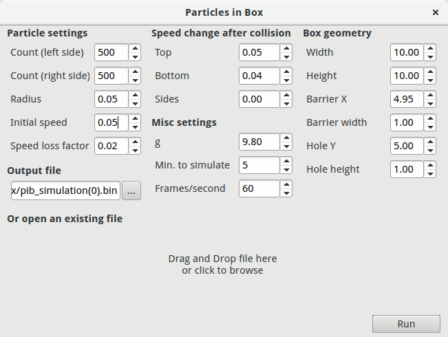
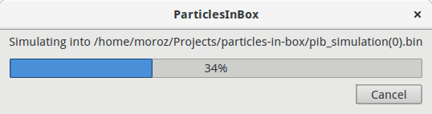
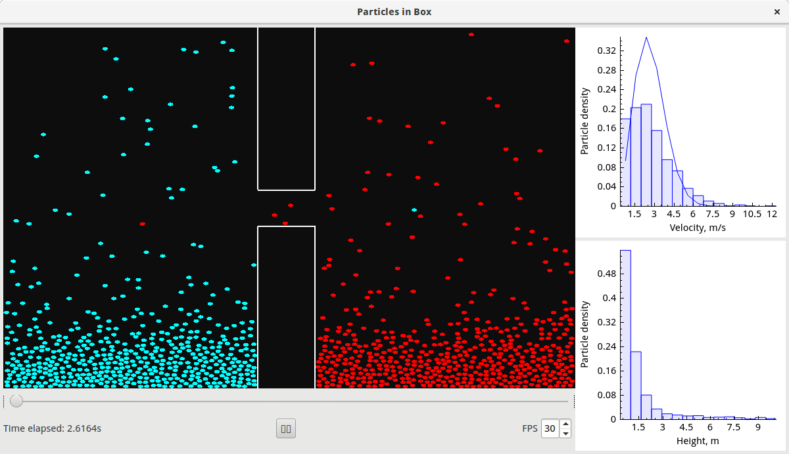

# Particles in box

Программа, созданная для визуализации и исследования распределения Максвелла.

Разработана в НИУ МИЭТ под руководством профессора кафедры общей физики Гайдукова Геннадия Николаевича.

================

## Зависимости:

[QCustomPlot](http://www.qcustomplot.com/)

## Скриншоты:

